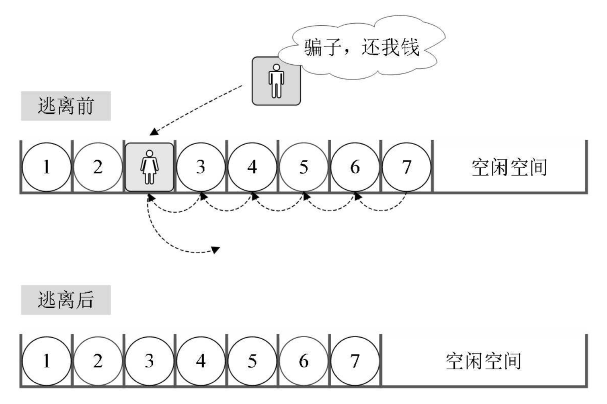

## 一 线性表概念 

线性表：零到多个数据元素组成的有限序列(线一样性质的表)。 

概念的解释：
- 序列：元素之间是有顺序的，若元素存在多个，则第一个元素无前驱，最后一个元素无后继，其他每个元素都有且只有一个前驱和后继。  
- 有限：元素的数量是有限的。不过计算机中的对象都是有限的，无限数列只存在于数学概念中。  

线性表图示：


线性表的元素的个数为n，n即使线性表的长度，n=0时，称为空表，非空表中，上述的i是元素的位序。  

线性表在日常生活中的案例：
- 幼儿园小朋友手拉手排队过马路：每个人记着自己的前一位和后一位。
- 星座

线性表的划分：  


## 二 线性表实现Go实现 

#### 2.1 线性表的抽象数据定义

```
线性表对象  LineList
线性表数据  Data = {a1, a2, a3, ... , an}
线性表方法    
           NewLineList()            # 初始化一个线性表
           IsEmpty()            	# 判断线性表是否为空
           Push()               	# 在list末尾插入元素
           GetByIndex()  			# 根据位置获取线性表某个元素
           GetByValue()  			# 根据值获取线性表表某个元素
```

#### 2.2 go语言原生list包

go语言中已经提供了list：
```go
package main

import (
	"fmt"
	"container/list"
)

func main() {

	l := list.New()
	l.PushBack("first")
	l.PushFront("67")
	fmt.Printf("%v", l)		// &{{0xc00009e060 0xc00009e030 <nil> <nil>} 2}

}
```

当然在学习场合，我们需要自己定义一个list对象，并提供list的常用操作方法。  

#### 2.2 顺序存储结构的线性表

上述所说的线性表只是一种逻辑结构，在物理上它的存储可以是顺序的也可以是链式的。  

线性表的顺序存储结构：用一段地址连续的存储单元依次存储线性表的数据元素    


注意：C系语言中数组(Go内使用了切片)，其索引位置从0开始

实现：
```go
package list

import (
	"errors"
	"fmt"
)

// 线性表结构体对象
type LineList struct {
	MaxSize int					// 该线性表最大容量
	Length int					// 该线性表当前长度
	Data []interface{}			// 线性表内数据
}

// 初始化线性表函数
func NewLineList(size int) *LineList {
	return &LineList{
		MaxSize: size,
		Length: 0,
		Data: make([]interface{}, size),
	}
}

// 判断线性表是否为空方法
func (l *LineList)IsEmpty() bool {
	if l.Length == 0 {
		return true
	}
	return false
}

// 判断线性表是否已满
func (l *LineList)IsFull() bool {
	if l.Length == l.MaxSize {
		return true
	}
	return false
}

// 判断线性表索引是否越界
func (l *LineList) isOver(index int) bool {
	if index < 1 || index > l.Length {
		return true
	}
	return false
}

// 插入元素：从末尾push一个数据
func (l *LineList)Push(data interface{})(bool, error) {
	if ok := l.IsFull(); ok {
		return false, errors.New("线性表已满，无法添加数据")
	}
	l.Data = append(l.Data, data)
	l.Length ++
	return true, nil
}

// 插入元素：任意位置插入元素
func (l *LineList)Insert(index int, data interface{}) (bool, error) {
	if ok := l.IsFull(); ok {
		return false, errors.New("线性表已满，无法添加数据")
	}
	if ok := l.isOver(index); ok {
		return false, errors.New("插入索引越界")
	}
	b,_ := l.Append("")			// 增加一个空数据，防止下面访问越界
	fmt.Println("插入临时空数据结果:", b)
	for j := l.Length - 1; j > index - 1; j -- {
		// 从后往前赋值，新增一个空节点，然后把数据一个个后移，直到插入位置
		l.Data[j] = l.Data[ j - 1]
	}
	l.Data[index - 1] = data
	return true, nil
}

// 删除元素：从末尾pop一个数据
func (l *LineList)Pop() (interface{}, error) {
	if ok := l.IsEmpty(); ok {
		return "", errors.New("表中没有任何元素")
	}
	lastE := l.Data[l.Length - 1]
	l.Data = l.Data[:l.Length - 1]
	l.Length --
	return lastE, nil
}

// 删除元素：从任意位置删除一个数据
func (l *LineList)Delete(index int) (interface{}, error) {
	if ok := l.isOver(index); ok {
		return "", errors.New("索引不在线性表范围内")
	}
	if ok := l.IsEmpty(); ok {
		return "", errors.New("空表没有课删除的数据")
	}
	deleteE := l.Data[index - 1]
	for j := index - 1; j < l.Length - 1; j++ {
		l.Data[j] = l.Data[ j + 1]
	}
	l.Data = l.Data[:l.Length - 1]
	l.Length --
	return deleteE,  nil
}

// 修改元素

// 查询某个元素
func (l *LineList)GetByIndex(index int) (interface{}, error) {
	if ok := l.isOver(index); ok {
		return "", errors.New("查询索引越界")
	}
	return l.Data[index - 1], nil
}
```

## 三 理解顺序结构存储的线性表 

#### 3.1 随机存取结构

假设一个线性表占据了c个存储单元，那么线性表中第`i+1`个数据元素的存储位置，第`i`个数据元素存储位置三者之间的关系(LOC是获取存储位置的函数)：  

LOC(a<sub>i+1</sub>) = LOC(a<sub>i</sub>) + c  

同样，对于第i个数据元素a<sub>i</sub>的存储位置可以由a<sub>1</sub>推算：  

LOC(a<sub>i</sub>) = LOC(a<sub>1</sub>) + (i - 1) * c   

如图所示：
  

通过上述公式，可以随时计算线性表中任意位置的地址，不管是最后一个还是第一个，都是相同的时间，那么我们队线性表位置的存入和取出数据，对于计算机来说都是相等的时间，是一个常数，用时间复杂度来表示的话，其存取时间性能为O(1)，通常将具备这一特点的存储结构称为随机存取结构。  


#### 3.2 插入与删除的理解 

插入：  
   

删除：  
   

如果元素插入到最后一个位置，或者删除最后一个位置，那么之前的数据元素无需排序，此时是最好的情况，时间复杂度为O(1)，因为不需要移动元素。  

如果是其他情况，则所有的数据元素都要进行移动，这个时间复杂度为O(n)。  

总结：
- 顺序结构存储的线性表，在存、读数据时，时间复杂度是O(1)
- 顺序结构存储的线性表，插入和删除时，时间复杂度都是O(n)