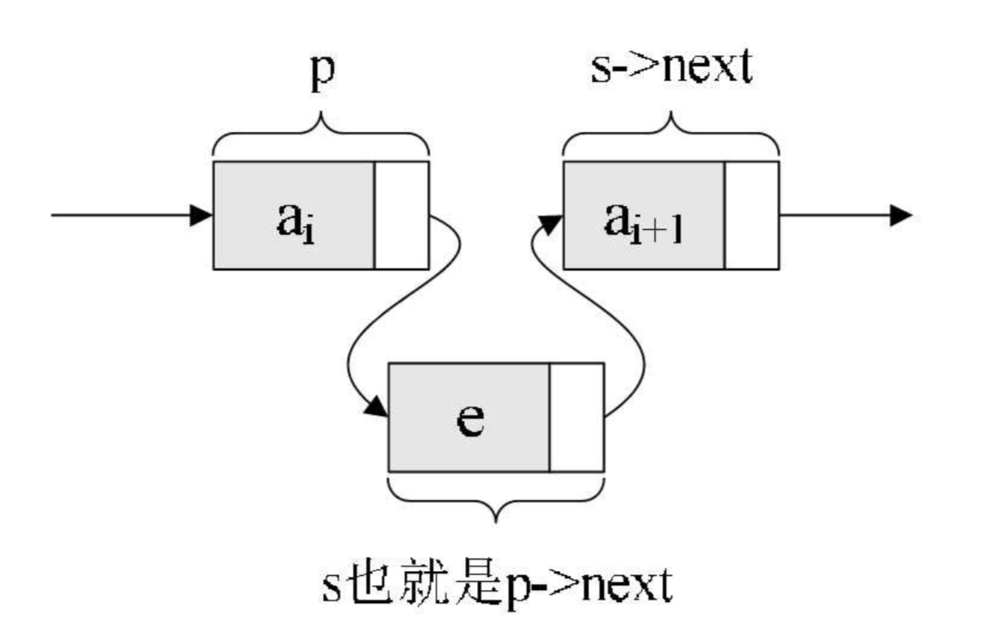

## 一 链表

#### 1.1 链表概述

线性表的顺序存储最大的缺点是插入和删除时需要移动大量数据。  

上述问题出现的原因是：所有的元素存储位置都是相邻的，中间没有缝隙，也就不能快速插入，同样，删除后留下的空隙也需要弥补上。  

线性表的链式存储可以用一组任意的存储的单元存储线性表的数据元素，这组存储单元可以是连续的，也可以是不连续的。这意味着，这些数据元素可以存在内存未被占用的任意位置。当然，这样也会随之而来一些问题：除了要存储数据元素信息外，还要存储它的后继元素的存储地址。  

  

#### 1.2 链表的结点

常见称谓：
- 数据域：存储数据元素信息
- 指针域：存储直接后继的位置
- 结点(Node)：数据域和指针域组成的数据元素a<sub>i</sub>的存储映像

n个Node链接成了一个链表，即使线性表的链式存储结构。  

  

#### 1.3 头指针与头结点

线性表都有头有尾，链表中的第一个Node的存储位置称为头指针，之后的每一个Node，其实都是上一个后继指针指向的位置。  

链表的最后一个Node，不存在后继，这个结点指针为空。   

  

为了方便对链表进行操作，有时候会在单链表的第一个结点前附设一个一个结点，称为头结点。头结点的数据域可以不存储任何信息，但可以存储如线性表的长度等附加信息。头结点的指针域存储指向第一个结点的指针，如图所示：   

  

头指针与头结点区别：  

头指针：
- 指链表指向第一个结点的指针，若链表有头结点，则指向头结点的指针
- 头指针具备标识作用，常用头指针冠以链表的名字
- 无论链表是否为空，头指针军不为空，是必要元素

头结点：
- 为了操作的统一设立，放在一个元素的结点之前，一般没有实际意义
- 有了头结点，对在第一元素结点前插入结点和删除第一结点，会方便统一
- 头结点不是链表必备元素 

#### 1.4 链表图示

空链表：  
  

普通链表：  
  

## 二 单链表Go实现

#### 2.1 单链表结构
```
单链表对象  LinkedList
线性表数据  Node{数据, next}          # next是下一个元素的指针
线性表方法    
           NewLinkedList()          # 初始化一个线性表
           IsEmpty()            	# 判断线性表是否为空
           Push()               	# 在list末尾插入元素
           GetByIndex()  			# 根据位置获取单链表某个元素
           GetByValue()  			# 根据值获获取单链表某个元素
```

#### 2.2 单链表实现

```go
/**
 * 单链表
 */

package list

import "errors"

// 先设计一个结点对象，存储单链表上某个结点数据
type node struct {
	Data interface{}			// 数据域
	Next *node					// 指针域
}

// 再设计单链表对象
type LinkedList struct {
	Head *node					// 单链表头，有了头结点，就能找到所有结点
	Length int					// 当前链表中数据元素数量
}

// 创建单链表
func NewLinkedList() *LinkedList {
	head := &node{0, nil}
	return &LinkedList{
		head,
		0,
	}
}

// 判断空
func (ll *LinkedList)IsEmpty() bool {
	return ll.Head.Next == nil
}

// 增加：从尾部增加一个结点
func (ll *LinkedList) Push(o interface{}){
	appendNode := &node{o, nil}			// 要插入的结点
	lastNode := ll.Head.Next						// 查找最后一个结点
	if lastNode == nil {							// 第一次添加
		ll.Head.Next = appendNode
		ll.Length ++
		return
	}
	for lastNode.Next != nil {						// 不是第一次添加
		lastNode = lastNode.Next
	}

	lastNode.Next = appendNode
	ll.Length ++
}

// 增加：任意位置插入结点
func (ll *LinkedList) Insert(index int, o interface{}) (bool, error){
	if index < 0 || index > ll.Length {
		return false, errors.New("无效的插入位置")
	}
	currentNode := ll.Head
	for i := 0; i < index; i++ {
		currentNode = currentNode.Next		// 找到要插入的位置
	}
	appendNode := &node{Data:o, Next:nil}
	appendNode.Next = currentNode.Next
	currentNode.Next = appendNode
	ll.Length ++
	return true, nil

}

// 删除：删除指定位置结点
func (ll *LinkedList) Delete(index int) (bool, error) {
	if index < 0 || index >= ll.Length {
		return false, errors.New("指定索引位置有误")
	}
	currentNode := ll.Head
	var beforeNode *node
	for i := 0; i <= index; i++ {
		beforeNode, currentNode = currentNode,  currentNode.Next
	}
	beforeNode.Next = currentNode.Next
	currentNode = nil
	ll.Length --
	return true, nil
}

// 查询： 获取指定位置结点
func (ll *LinkedList) GetByIndex(index int) (*node, error) {
	if index < 0 || index >= ll.Length {
		return nil, errors.New("索引越界")
	}
	currentNode := ll.Head
	for i := 0; i <= index; i++ {
		currentNode = currentNode.Next
	}
	return currentNode, nil
}

// 清空链表
func (ll *LinkedList) Clear() {
	currentNode := ll.Head.Next
	for currentNode != nil {
		temp := currentNode.Next
		currentNode = nil
		currentNode = temp
	}
	ll.Head.Next = nil
}
```

测试：
```go
package main

import (
	"algorithm/list"
	"fmt"
)

func main() {

	ll := list.NewLinkedList()
	ll.Push(11)
	fmt.Println(ll.Head.Next.Data)
	fmt.Println(ll.Length)

	ll.Push(22)
	fmt.Println(ll.Head.Next.Next.Data)
	fmt.Println(ll.Length)

	fmt.Println(ll.Insert(2, 66))
	fmt.Println(ll.Head.Next.Next.Data)
	fmt.Println(ll.Length)

	fmt.Println(ll.GetByIndex(2))
}
```

## 三 理解单链表  

单链表的插入图示：  


单链表的插入无需惊动其他结点，只需要让s->next和p->next的指针做一点改变即可。  

同样，删除也是一样的道理。  

如果我们不知道第i个结点的位置，单链表数据结构在插入和删除操作上，与线性表的顺序存储结构相比没有太大优势。  

但是一旦知道精确的位置，无论插入多少个元素，找到第i位置的指针复杂度为O(n)，但是插入只是简单的移动指针，时间复杂度都是O(1)，而顺序结构线性表，每次移动都是O(n)，所以，对于插入或者删除数据越频繁的操作，单链表的效率优势越明显。

