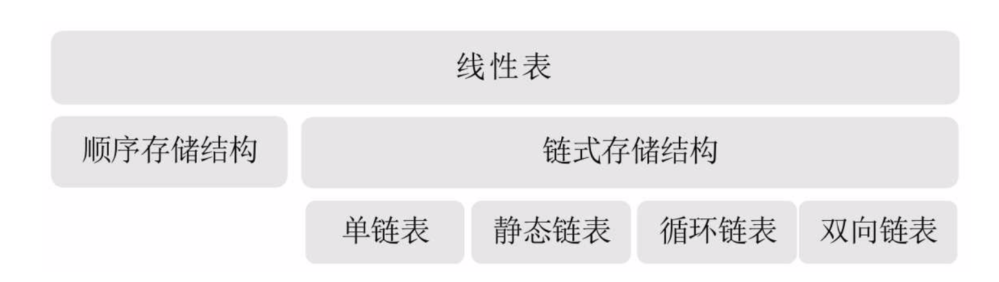

## 一 线性表分类总结

## 二 线性表使用总结

#### 2.1 顺序存储线性表
整体而言，线性表适合元素个数不太变化，经常存取数据的场景。  

线性表优点：
- 无需为表示数据结构的逻辑关系增加额外空间
- 可以快速存取表中任一位置元素

线性表缺点：
- 插入和删除操作需要移动大量元素
- 线性表长度变化较大时，难以确定容量(MaxSize)
- 容易造成存储空间碎片

#### 2.2 链表与顺序线性表对比

存储分配方式：  
- 顺序结构：用一段连续的存储单元依次存储
- 单链表：使用链式结构，用一组任意的存储单元存储

时间性能：
- 顺序结构：查询性能为O(1)，插入删除性能为O(n) 
- 单链表：：查询性能为O(n)，插入删除性能为O(1)  

空间性能：
- 顺序结构：需要预分配空间，分大了浪费，分小了容易溢出
- 单链表：：无需分配空间，即个数也不受限制

总结：需要频繁查找，使用顺序存储，需要频繁更新，使用链式存储

#### 2.3 静态链表

- 优点：插入阐述只用改游标，不用移动元素，破除了顺序存储的缺点
- 缺点：没有解决连续存储分配带来的表长无法确定问题，失去了顺序结构随机存取特性

贴士：静态链表只是给一些没有指针的高级语言提供了一种实现方案。  

