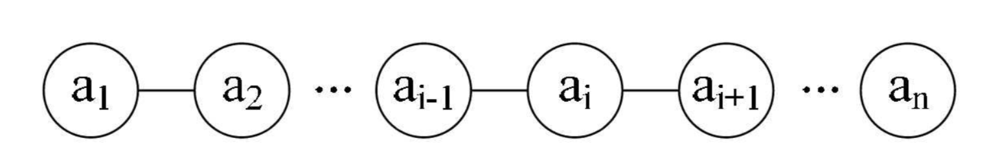

## 一 线性表概念 

线性表：零到多个数据元素组成的有限序列(线一样性质的表)。 

概念的解释：
- 序列：元素之间是有顺序的，若元素存在多个，则第一个元素无前驱，最后一个元素无后继，其他每个元素都有且只有一个前驱和后继。  
- 有限：元素的数量是有限的。不过计算机中的对象都是有限的，无限数列只存在于数学概念中。  

线性表图示：

线性表的元素的个数为n，n即使线性表的长度，n=0时，称为空表，非空表中，上述的i是元素的位序。  

线性表在日常生活中的案例：
- 幼儿园小朋友手拉手排队过马路：每个人记着自己的前一位和后一位。
- 星座

线性表的划分：  
