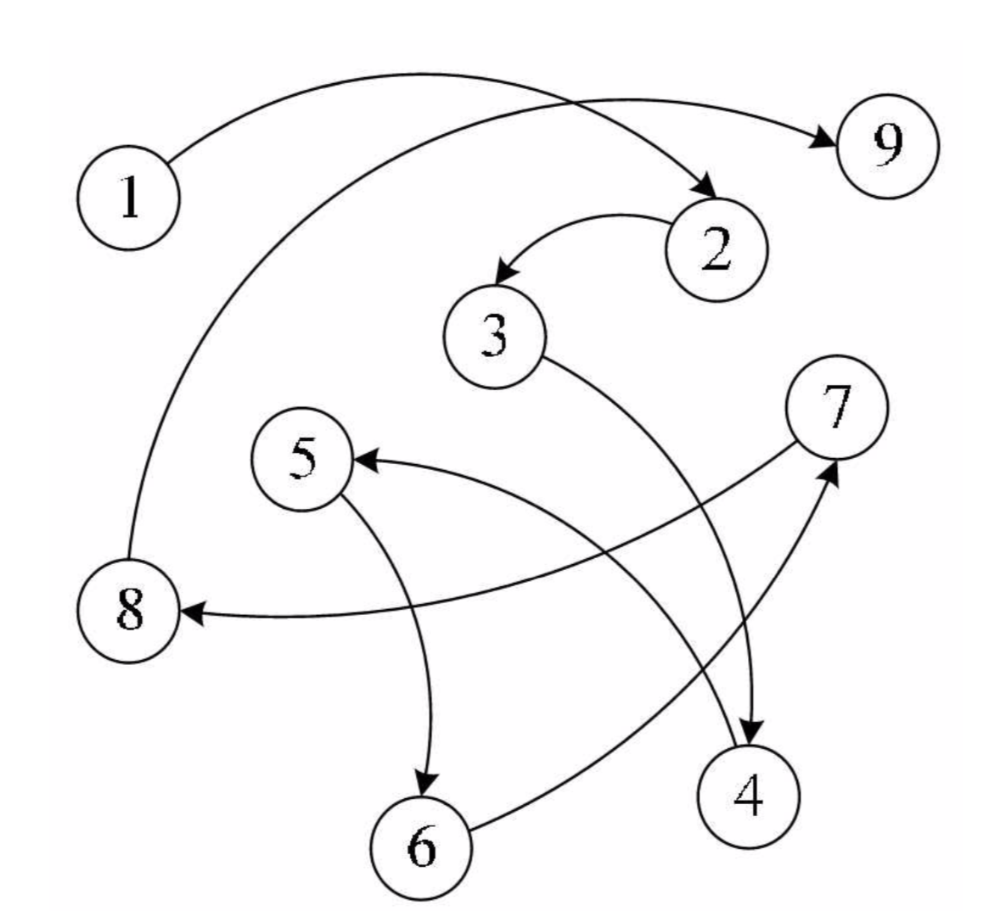
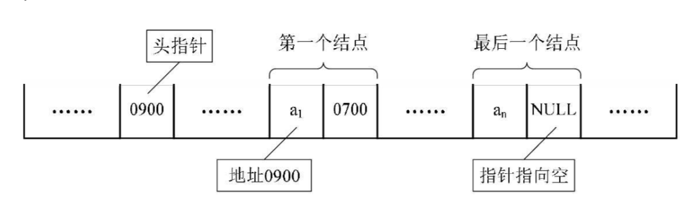
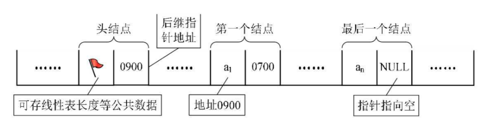
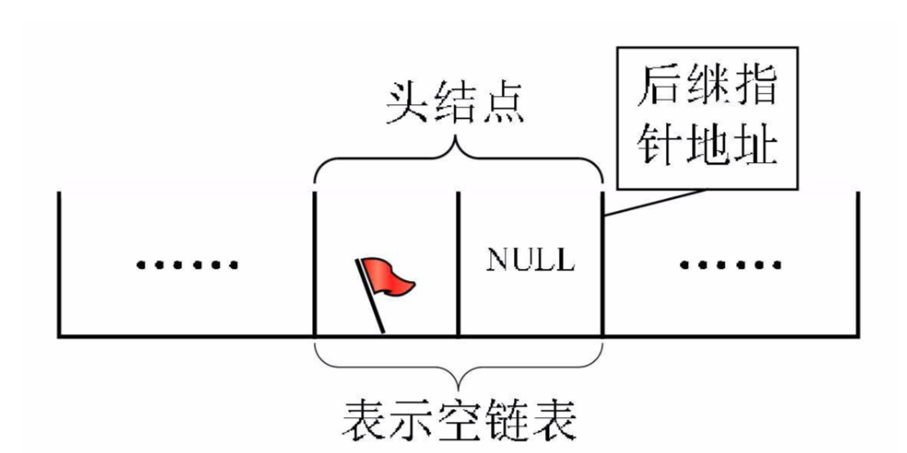
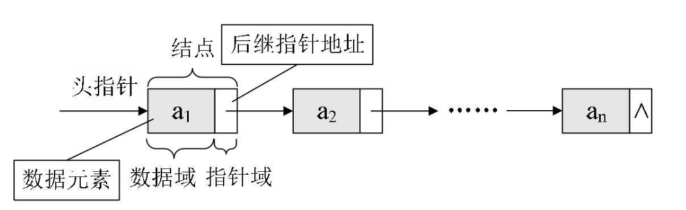

## 一 链表

#### 1.0 数组的缺点

数组并不是存储数据的最佳数据结构。在很多编程语言中，数组的长度是固定的，所以当数组已被数据填满时，再要加入新的元素就会非常困难。  

在数组中，添加和删除元素也很麻烦，因为需要将数组中的其他元素向前或向后移动，以反应数组刚刚进行了添加或删除操作。  

当你发现使用数组非常慢时，可以考虑使用链表来代替他。链表可以用在任何可以用一维数组的情况中，但是如果需要随机访问，数组仍然是更好的选择。  

贴士：
- JS中的数组并不存在上述问题，使用splice()方法不需要再访问数组中的其他元素了，因为在JS中数组被实现成了对象，也因此与其他语言相比，JS的数组效率极低

#### 1.1 链表概述

线性表的顺序存储最大的缺点是插入和删除时需要移动大量数据。  

上述问题出现的原因是：所有的元素存储位置都是相邻的，中间没有缝隙，也就不能快速插入，同样，删除后留下的空隙也需要弥补上。  

线性表的链式存储可以用一组任意的存储的单元存储线性表的数据元素，这组存储单元可以是连续的，也可以是不连续的。这意味着，这些数据元素可以存在内存未被占用的任意位置。当然，这样也会随之而来一些问题：除了要存储数据元素信息外，还要存储它的后继元素的存储地址。  

  

#### 1.2 链表的结点

常见称谓：
- 数据域：存储数据元素信息
- 指针域：存储直接后继的位置
- 结点(Node)：数据域和指针域组成的数据元素ai的存储映像

n个Node链接成了一个链表，即使线性表的链式存储结构。  

  

#### 1.3 头指针与头结点

线性表都有头有尾，链表中的第一个Node的存储位置称为头指针，之后的每一个Node，其实都是上一个后继指针指向的位置。  

链表的最后一个Node，不存在后继，这个结点指针为空。   

  

为了方便对链表进行操作，有时候会在单链表的第一个结点前附设一个一个结点，称为头结点。头结点的数据域可以不存储任何信息，但可以存储如线性表的长度等附加信息。头结点的指针域存储指向第一个结点的指针，如图所示：   

  

头指针与头结点区别：  

头指针：
- 指链表指向第一个结点的指针，若链表有头结点，则指向头结点的指针
- 头指针具备标识作用，常用头指针冠以链表的名字
- 无论链表是否为空，头指针军不为空，是必要元素

头结点：
- 为了操作的统一设立，放在一个元素的结点之前，一般没有实际意义
- 有了头结点，对在第一元素结点前插入结点和删除第一结点，会方便统一
- 头结点不是链表必备元素 

#### 1.4 链表图示

空链表：  
  

普通链表：  
  