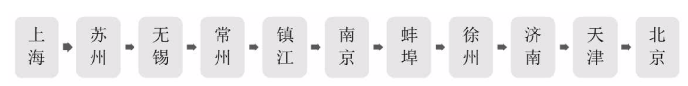

## 一 循环链表的引出  

对于单链表，由于每个节点只存储了向后的指针，到了尾标志就停止了向后链的操作，这样，当中某一个节点就无法找到它的前驱节点了。   

现实生活中也经常有这样的案例，工作需要经常出差，往返于北京上海之间，沿线铁路要经过许多城市：  

在单链表中，假如出差到南京，然后被要求所有城市走一遍，单链表就无法实现了，此时把上海和北京联系到一起，就解决了。   

将单链表中终端节点的指针端由空指针改为指向头节点，就会使整个单链表形成一个环，这种头尾相接的单链表称为单循环链表，简称循环链表。循环链表解决了从任意节点出发，访问链表全部节点的问题。  

## 二 循环链表的实现
将单链表改造为循环链表很简单：在循环判断中只用将.next是否为空修改为是否为头节点即可。  

