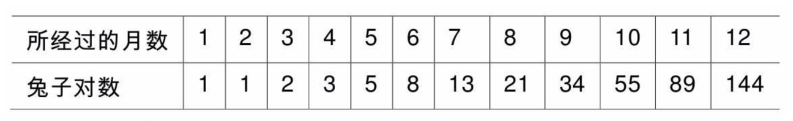
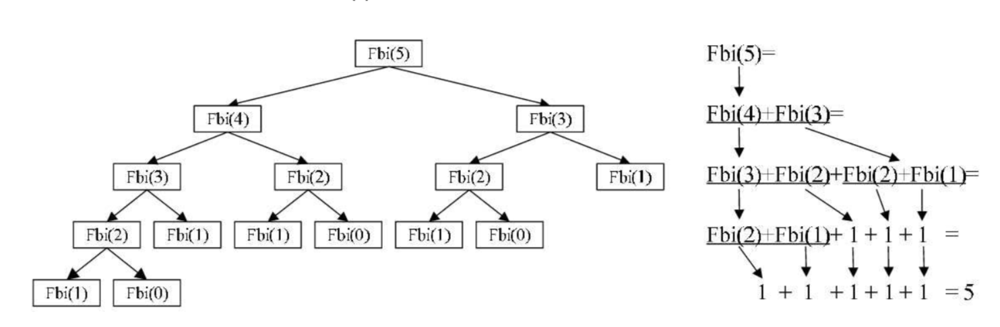

## 一 栈的应用

有了数组和链表，为何还要制作独立的栈对象呢？因为栈对于使用者来说，更加抽象了，不用去关心底层的数据移动、增加删除问题。  

在回溯问题中，栈可以用来存储访问过的任务、路径、撤销操作，在JAVA中，栈用来存储变量和方法调用，处理递归方法时，会抛出栈溢出异常。  

## 二 使用栈解决问题

#### 2.1 递归问题-解决斐波那契数列

如果兔子出生2个月后，一对兔子每个月能生出一对小兔子，假设所有兔子不死，一年后将会有多少对兔子？  



这里有一个很明显的特点：前两项之和等于第三项，使用函数来表述：
```go
func Fbi(i int) int{
    if i == 0 || i == 1{
        return i
    }
    return Fbi(i - 1) + Fbi(i - 2)
}
```

在前行阶段，每一层递归，函数的局部变量、参数值以及返回地址都被压入栈中，在退回结点，位于栈顶的局部变量、参数值、返回地址都被弹出，用于返回调用层次中执行代码的其余部分，也就是恢复了调用的状态。  

模拟代码中的Fbi函数执行：  



## 三 使用JS的栈解决一些常见问题   

#### 3.1 转换进制
```JavaScript
function mulBase(num, base) {

    if (base < 2 || base >= 10) {
        return "传入进制参数不合法";
    }

    var s = new Stack();
    
    do {
        s.push(num % base);
        num = Math.floor(num / base);
    } while(num > 0);

    var converted = "";
    while (s.size() > 0) {
        converted += String(s.pop());
    }

    return converted;
}

console.log(mulBase(4,2));      // 输出100
```
#### 3.2 判断回文
回文：单词“dad”反过来和之前是一样的，这样的叫做回文。
```js
function isPalindrom(word) {
    var s = new Stack();
    for (var i = 0; i < word.length; i++) {
        s.push(word[i]);
    }
    var  rword = "";
    while (s.size() > 0) {
        rword += String(s.pop());
    }
    return (word == rword) ? true : false;
}
```