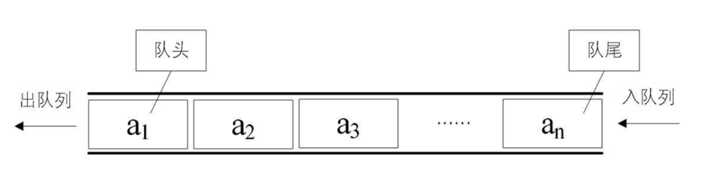
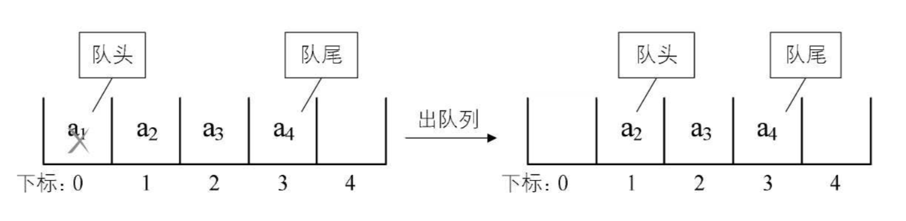

## 一 队列

队列也是特殊的线性表，遵循FIFO（先进先出）规则，即在尾部添加元素，并从顶部移除元素，最新添加的元素必须排在队列的末尾。  



在现实中最常见的队列就是排队，键盘的输入到显示器上的输出等。  

## 二 队列Go实现

#### 2.1 队列的顺序存储

由于队列也是线性表，队列也有顺序存储和链式存储两种方式。  

如果使用顺序存储：
- 入队时，只是给数组数据最后一位添加一个元素，不需要移动任何数据，时间复杂度是O(1)
- 出队时，给数组数据的头部添加一个元素，其他所有元素都要往后移动一位，时间复杂度是O(n)，出队的性能大幅降低。  

思考：出队时，队列的元素其实并不一定要移动，只要将队头的位置移动下即可：  

  

#### 2.2 循环队列

不过此时会引入一些新的问题，比比如入队的数据超过了数组之外，但是队头并不在下标为0的位置，而是在1或者2等之后，这时候就会出现假溢出的现象。  

解决假溢出的办法就是后面满了，再从头开始，制作一个头尾相接的循环，这种结构称之为循环队列。 

循环队列解决的问题：出队入队的数据移动尔问题，解决假溢出问题。

## 三 队列JS实现 

JS实现一个队列和实现栈一致，只不过内部的数组需要做一定的先进先出处理：
```javascript
let Queue = (function(){
    const store = new WeakMap();
    class Queue {
        constructor () {
            store.set(this, []);
        }
        enqueue (e) {                  //向队尾添加元素
            store.get(this).push(e);
        }
        dequeue () {                    //删除队首元素
            return store.get(this).shift();
        }
        front() {                        //获取队尾元素
            return store.get(this)[0];
        }
        back() {                       //获取队首元素
            return store.get(this)[store.get(this).length - 1];
        }
        isEmpty() {                     //判断队列是否为空
            return (store.get(this).length == 0) ? true : false;
        }
        //...
    }
    return Queue;
})();
```
测试代码：
```js
let q = new Queue();
q.enqueue("test1");
q.enqueue("test2");
q.dequeue();
console.log(q.front())
```

## 二 队列实践
#### 2.1 基数排序
早期的计算机中，程序是通过穿孔卡输入主机的，每张卡包含一条程序语句。这些穿孔卡装在一个盒子里，经过一个机械装置进行排序。  
使用一组队列来模拟这个过程，叫做基数排序，它不是最快的排序算法，但是可以很好的展示队列的作用。
对于0-99的数字，基数排序将数据集扫描两次，第一次按个位上的数字进行排序，第二次按十位上的数字进行排序。每个数字根据对应作为上的数值被分在不同的盒子里。假设有如下数字：
```
91 46 85 15 92 35 31 22
```
经过基数排序第一次扫描后，数字被分配到如下盒子中：
```
Bin 0:
Bin 1: 91 31
Bin 2: 92 22
Bin 3:
Bin 4:
Bin 5: 85 15 35
Bin 6: 46
Bin 7:
Bin 8:
Bin 9:
```
根据盒子的顺序，对数字进行第一次排序的结果如下：
```
91 31 92 22 85 15 35 46
```
然后根据十位上的数再分配到不同的盒子中：
```
Bin 0:
Bin 1: 15
Bin 2: 22
Bin 3: 31 35
Bin 4: 46
Bin 5: 
Bin 6: 
Bin 7:
Bin 8: 85
Bin 9: 91 92
```
此时将盒子里的数字取出，组成一个新的列表，就是排序好的数字。  
使用队列代表盒子，可以实现这个算法，我们需要九个队列，每个对应一个数字，将所有的队列保存在一个数组中，使用取余和除法操作决定各位和十位。算法的剩余部分将数字加入响应的队列，根据各位数值对其进行重新排序，然后再根据十位上的数值进行排序，结果即为排序好的数字。
```js
//根据响应个位、十位上的数值，将数字分配到相应队列的函数
function distribute(num, queues, n, digit) {            //digit为个位或十位上的值
    for(var i = 0; i < n; ++i) {
        if(digit == 1) {
            queues[nums[i] % 10].enqueue(nums[i]);
        } else {
            queues[Math.floor(nums[i] / 10)].enqueue(nums[i]);
        }
    }
}

//从队列中收集数字函数
function collect(queues, nums) {
    var i = 0;
    for (var digit = 0; digit < 10; ++digit) {
        while(!queues[digit].isEmpty()) {
            nums[i++] = queues[digit].dequeue();
        }
    }
}


//主程序
var queues = [];
for (var i = 0; i < 10; i++) {
    queues[i] = new Queue();
}
var nums = [];
for (var i = 0; i < 10; i++) {
    nums[i] = Math.floor(Math.floor(Math.random() * 101));
}

console.log("Before sort:", nums);

distribute(nums, queues, 10, 1);
collect(queues, nums);
console.log("First sort:", nums);

distribute(nums, queues, 10, 10);
collect(queues, nums);
console.log("Second sort:", nums);
```
## 三 优先级队列
在一般情况下，在队列中删除的元素，一定是率先入队的元素，但是也有非常时刻不遵循该约定，可以使用优先队列的数据结构来模拟。
比如在医院内，都是按照挂号顺序排队看医生，但是有急诊时需评估患者严重程度，给与一定的优先级。
重新定义队列的dequeue()方法，使其按照优先级来删除元素。
```js
//code是一个整数，表示优先级，越小优先级越高
dequeue () {                   
    var entry = 0;
    for (var i = 0; i < store.get(this).length; ++i) {
        if(store.get(this)[i].code < store.get(this)[entry].code) {
            entry = i;
        }
    }
    return store.get(this).splice(entry, 1);
}
```
使用优先级队列：
```js
// 定义存储队列元素的对象
function Patient(name, code) {
    this.name = name;
    this.code = code;  
}

var p1 = new Patient("list", 5);
var p2 = new Patient("zs", 3);
var p3 = new Patient("ww", 7);
var q = new Queue;
q.enqueue(p1);
q.enqueue(p2);
q.enqueue(p3);

console.log("第一次出队结果：", q.dequeue());   //[ Patient { name: 'zs', code: 3 } ]
console.log("第二次出队结果：", q.dequeue());   //[ Patient { name: 'list', code: 5 } ]
```
