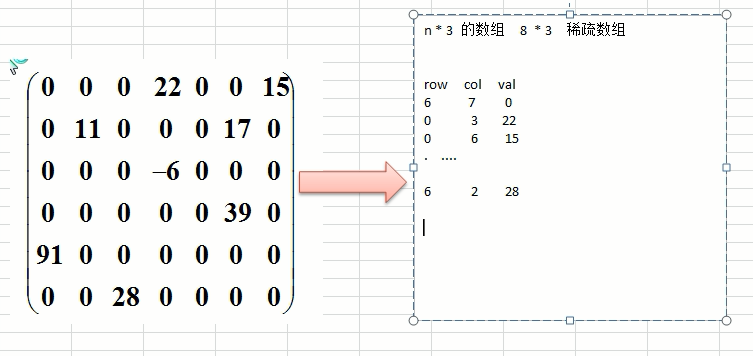

## 一 数组概念

数组是最简单的数据结构之一，基本所有的语言都提供了数组，这里只是对数组做出简单的介绍。

## 二 数组的增删改查

## 三 稀疏数组

#### 3.1 问题的引入

如下所示的五子棋程序，有存盘退出和续上盘的功能：  

如果使用二维数组来存储，就会如右侧所示存储很多为0的浪费空间。  

#### 3.2 稀疏数组存储数据

当一个数组中大部分元素为0，或者为同一个值的数组时，可以使用稀疏数组来保存该数组，其处理方式为：
- 记录数组一共有几行几列，有多少个不同的值
- 把具有不同值的元素的行列/值记录在一个小规模数组中

如图所示：  

图中的row/，col，val分别代表有多少行，多少列，对应值，其中第一条数据6，7，10存储了左侧数据总计有6行，7列，10个不同值。  

#### 3.3 原始数组转换为稀疏数组

