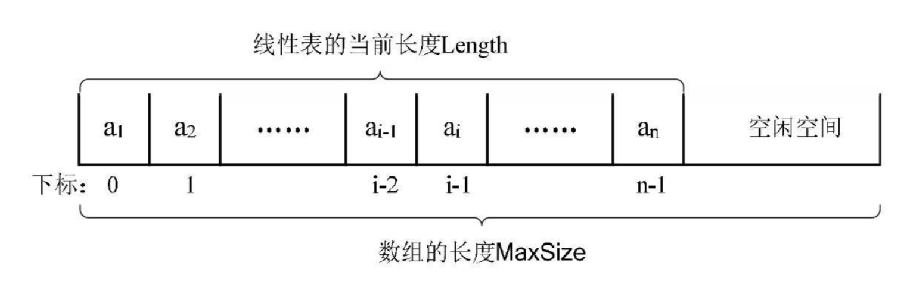
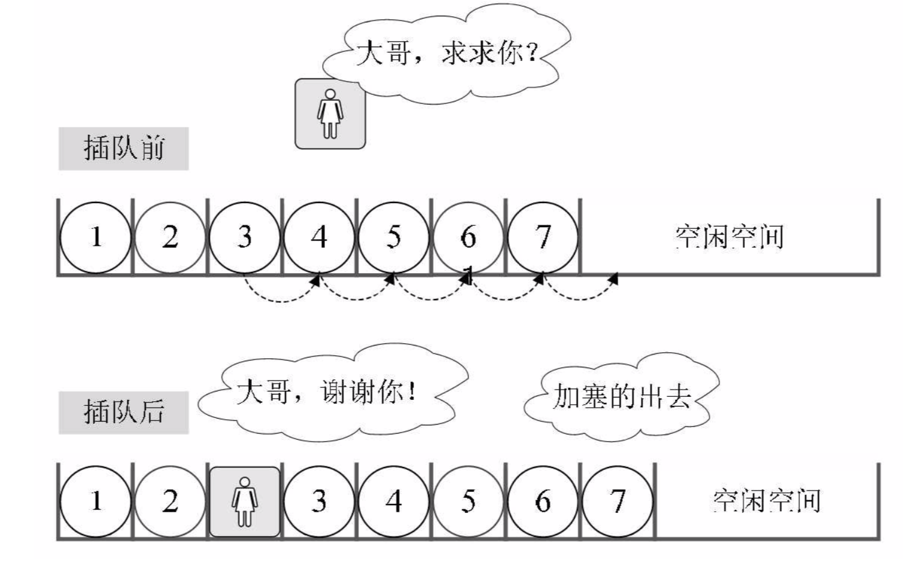

## 一 Go语言原生线性表

go语言中已经提供了list：
```go
package main

import (
	"fmt"
	"container/list"
)

func main() {

	l := list.New()
	l.PushBack("first")
	l.PushFront("67")
	fmt.Printf("%v", l)		// &{{0xc00009e060 0xc00009e030 <nil> <nil>} 2}

}
```

当然在学习场合，我们需要自己定义一个list对象，并提供list的常用操作方法。

## 二 顺序结构存储线性表

#### 2.1 顺序结构存储方式简介 

线性表只是一种逻辑结构，在物理上它的存储可以是顺序的也可以是链式的。  

线性表的顺序存储结构：用一段地址连续的存储单元依次存储线性表的数据元素。如图所示：  



注意：C系语言中数组索引位置从0开始。


#### 2.2 顺序结构存储方式定义

```
线性表对象  SequenList
线性表数据  Data = {a1, a2, a3, ... , an}
线性表方法    
           NewSequenList()            	# 初始化一个线性表
           IsEmpty()            		# 判断线性表是否为空
		   Append()						# 从线性表末尾添加元素
		   Insert()						# 从某个位置添加元素
```

#### 2.2 顺序结构存储方式实现


## 三 理解顺序结构存储的线性表 

#### 3.1 随机存取结构

假设一个线性表占据了c个存储单元，那么线性表中第`i+1`个数据元素的存储位置，第`i`个数据元素存储位置三者之间的关系(LOC是获取存储位置的函数)：  

LOC(a<sub>i+1</sub>) = LOC(a<sub>i</sub>) + c  

同样，对于第i个数据元素a<sub>i</sub>的存储位置可以由a<sub>1</sub>推算：  

LOC(a<sub>i</sub>) = LOC(a<sub>1</sub>) + (i - 1) * c   

如图所示：
  

通过上述公式，可以随时计算线性表中任意位置的地址，不管是最后一个还是第一个，都是相同的时间，那么我们队线性表位置的存入和取出数据，对于计算机来说都是相等的时间，是一个常数，用时间复杂度来表示的话，其存取时间性能为O(1)，通常将具备这一特点的存储结构称为随机存取结构。  


#### 3.2 插入与删除的理解 

插入：  
   

删除：  
   

如果元素插入到最后一个位置，或者删除最后一个位置，那么之前的数据元素无需排序，此时是最好的情况，时间复杂度为O(1)，因为不需要移动元素。  

如果是其他情况，则所有的数据元素都要进行移动，这个时间复杂度为O(n)。  

总结：
- 顺序结构存储的线性表，在存、读数据时，时间复杂度是O(1)
- 顺序结构存储的线性表，插入和删除时，时间复杂度都是O(n)