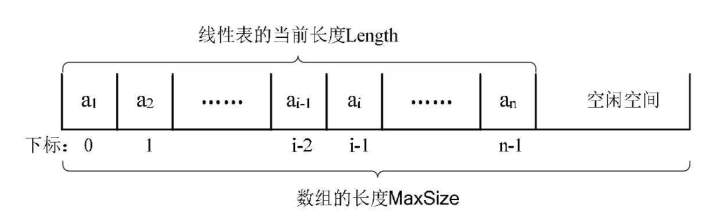
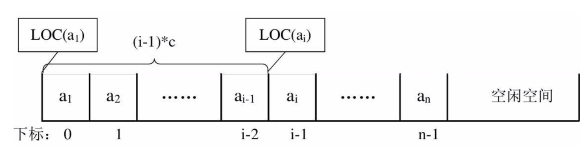

## 一 顺序表

#### 1.1 存储方式 

线性表只是一种逻辑结构，在物理上它的存储可以是顺序的也可以是链式的，顺序表就是用一段地址连续的存储单元依次存储线性表的数据元素。如图所示：  



#### 1.2 随机存取结构

假设一个线性表占据了c个存储单元，那么线性表中第`i+1`个数据元素的存储位置，第`i`个数据元素存储位置三者之间的关系(LOC是获取存储位置的函数)：  

LOC(a<sub>i+1</sub>) = LOC(a<sub>i</sub>) + c  

同样，对于第i个数据元素a<sub>i</sub>的存储位置可以由a<sub>1</sub>推算：  

LOC(a<sub>i</sub>) = LOC(a<sub>1</sub>) + (i - 1) * c   

如图所示：
  

通过上述公式，可以随时计算线性表中任意位置的地址，不管是最后一个还是第一个，都是相同的时间，那么我们队线性表位置的存入和取出数据，对于计算机来说都是相等的时间，是一个常数，用时间复杂度来表示的话，其存取时间性能为O(1)，通常将具备这一特点的存储结构称为随机存取结构。  

#### 1.3 顺序表的修改 存取 

插入：  
   

删除：  
   

如果元素插入到最后一个位置，或者删除最后一个位置，那么之前的数据元素无需排序，此时是最好的情况，时间复杂度为O(1)，因为不需要移动元素。  

如果是其他情况，则所有的数据元素都要进行移动，这个时间复杂度为O(n)。  

总结：
- 顺序结构存储的线性表，在存、读数据时，时间复杂度是O(1)，因为是一段连续的内存，直接可以通过索引获得
- 顺序结构存储的线性表，插入和删除时，时间复杂度都是O(n)，因为需要重新移动位置

## 二 顺序表实现

#### 1.2 顺序表定义

```
顺序表对象  
    SequenList {                        # 伪代码，模拟一个对象
        size                            # 顺序表的长度
        length                          # 顺序表元素的个数
        data                            # 顺序表的数据
    }

顺序表方法    
           NewSequenList()            	# 初始化一个顺序表
           IsEmpty()            		# 判断顺序表是否为空
		   Append()						# 从顺序表末尾添加元素
		   Insert(index)				# 从顺序表某个位置添加元素
           ...
```

#### 1.3 顺序表实现

```go

```


