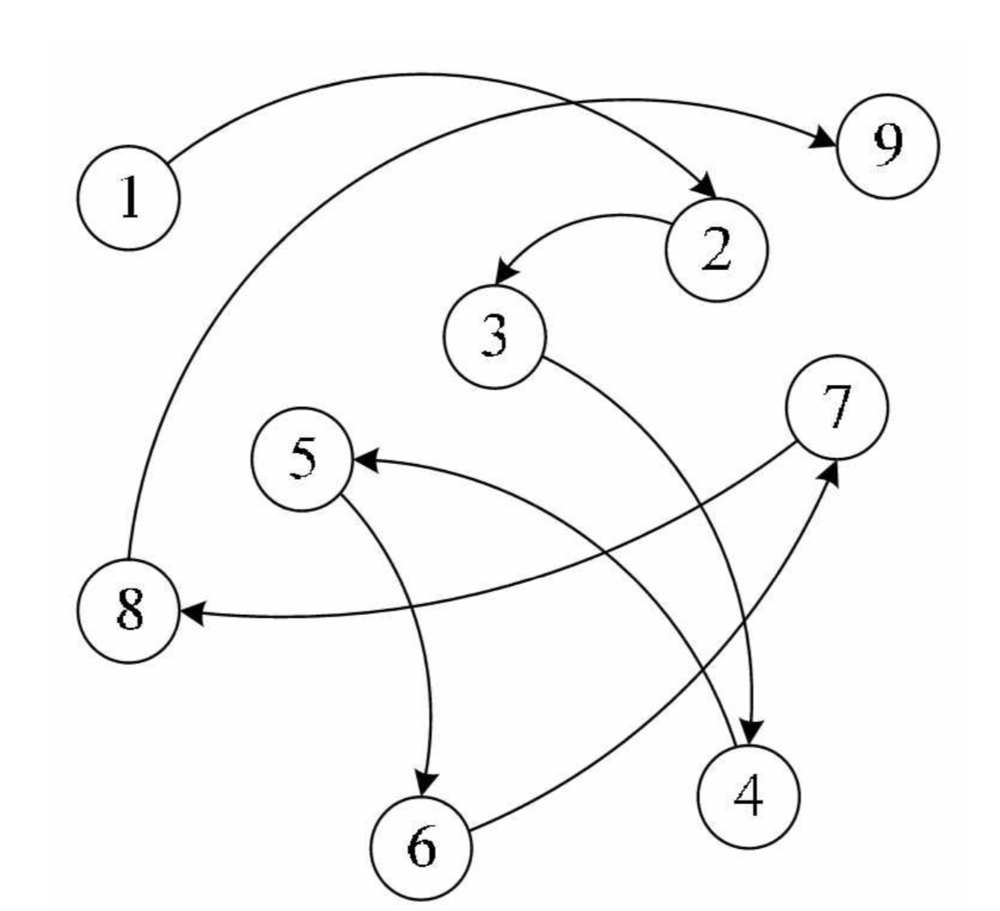

## 一 链表

#### 1.1 数组和顺序表的缺点

数组并不是存储数据的最佳数据结构。在很多编程语言中，数组的长度是固定的，所以当数组已被数据填满时，再要加入新的元素就会非常困难。  

在数组中，添加和删除元素也很麻烦，因为需要将数组中的其他元素向前或向后移动。   

贴士：JS中的数组并不存在上述问题，使用splice()方法不需要再访问数组中的其他元素了，因为在JS中数组被实现成了对象，也因此与其他语言相比，JS的数组效率极低。

同样,顺序表也存在插入和删除时需要移动大量数据的问题。  

#### 1.2 链表概述  

上述问题出现的原因是：所有的元素存储位置都是相邻的，中间没有缝隙，也就不能快速插入，同样，删除后留下的空隙也需要弥补上。  

线性表的链式存储可以用一组任意的存储单元存储数据元素，这组存储单元可以是连续的，也可以是不连续的。这意味着，这些数据元素可以存在内存未被占用的任意位置。当然，这样也会随之而来一些问题：除了要存储数据元素信息外，还要存储它的后继元素的存储地址。  

  

#### 1.2 链表的节点

链表的组成：
- 数据域：存储数据元素信息
- 指针域：存储直接后继的位置
- 节点(Node)：数据域和指针域组成的数据元素ai的存储映像

n个Node链接成了一个链表，即是线性表的链式存储结构。  

  

#### 1.3 头指针与头节点

线性表都有头有尾，链表中的第一个Node不存储元素数据，只存储第一个具体元素的指针地址，称为头指针，之后的每一个Node，其实都是上一个后继指针指向的位置。链表的最后一个Node，不存在后继，这个节点的指针域为空。   

  

但是为了方便对链表进行操作，有时候会在单链表的第一个节点前附设一个结点，称为头节点。头节点的数据域一般不存储任何信息，或者存储如线性表的长度等附加信息。头节点的指针域存储指向第一个节点的指针，如图所示：   

  
  

头指针：
- 指向第一个节点的指针，若链表有头节点，则指向头节点
- 头指针具备标识作用，常用头指针冠以链表的名字
- 无论链表是否为空，头指针均不为空，是必要元素

头节点：
- 为了操作的统一设立，放在第一个节点之前，一般没有实际意义
- 有了头结点，对第一节点前插入，删除第一节点等操作会更加简便
- 头节点不是链表必备元素 