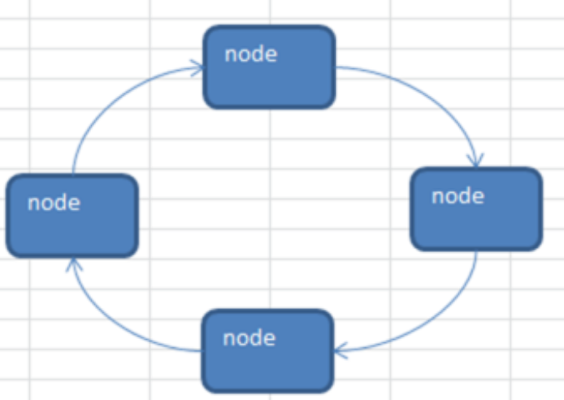

## 一 循环链表的引出  

对于单链表，由于每个节点只存储了向后的指针，我们无法找到它的前驱节点。   
  
将单链表中终端节点的指针指向头节点，就会使整个单链表形成一个环，这种头尾相接的单链表称为单循环链表，简称循环链表。  

循环链表解决了从任意节点出发，访问链表全部节点的问题。  

循环链表结构图：

## 二 循环链表的实现

贴士：只用将单链表循环判断的.next是否为空修改为是否为头节点即可。   

## 三 循环链表的头尾指针

如上所示，我们定义的链表结构体

