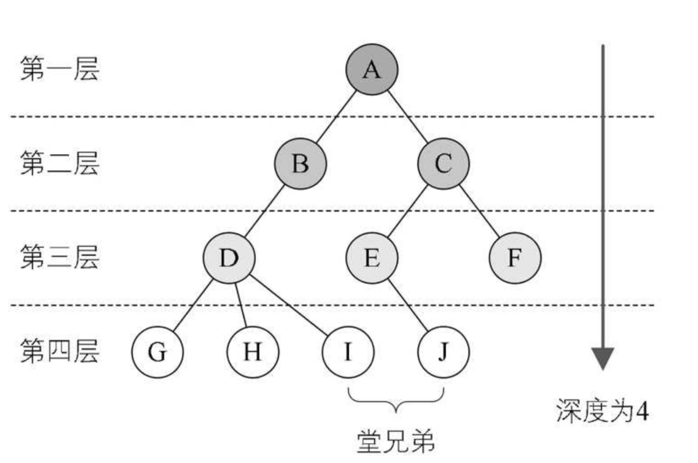

## 一 树的简介

#### 1.1 树形结构

线性表中具体的单个元素之间的关系是一对一的线性结构。现实中，仍然有很多一对多的情况，比如：文件系统中不同层级的文件，公司的行政架构图。

此时可以用树（Tree）来标识，树是一种非线性数据结构，经常用来存储具有层级关系的数据，它是n（n>=0）个节点的有限集，n=0时称为空树。  

在任意一棵非空的树中：
- 有且仅有一个特定的根节点(Root)
- 当n>1时，其余节点可分为m（m>0）个互不相交的有限集T<sub>1</sub>、T<sub>2</sub>....、T<sub>m</sub>，其中每一个集合本身又是一棵树，并且称为根的子树（SubTree）

如图所示:   


#### 1.2 树的理解

树的定义其实采用了递归的方法，如图所示，两个子树其实是根节点A的子树，当然D,G,H,I组成的树又是B为根节点的子树，以此类推：  


除了要主要根节点的唯一性以外，子树之间一定是互不相交的，如下所示并不符合树的定义：


树的相关术语：
- 父节点：下方连接多个节点
- 子节点：父节点下的节点
- 度(De-gree)：拥有的子树数，树本身的度是树内各节点的度的最大值
- 叶节点(Leaf)：没有子节点的节点，即度为0，也称为终端节点
- 分支节点：度不为0的节点，也称为非终端节点，除了根节点外，分支节点也可以称为内部节点


节点的层次（Level）：根节点作为第一层，其孩子为第二层。  


有序树与无序树：
- 有序树：树中的节点的各个子树看成从左至右有次序不可互换
- 无序树：与有序树相反

## 二 树的存储结构

#### 2.1 双亲表示法

简单的顺序存储肯定不能满足树的关系（父子）。树的存储结构主要有三种：双亲表示法，孩子表示法，孩子兄弟表示法。   

双亲表示法的数据结构需要存储数据域本身，还要存储一个指向其双亲的指针域。  

```go
type Node struct {              // 表示一个节点
    data interface{}
    left  *Node
    right *Node
}

type Tree struct {
                         
}
```


